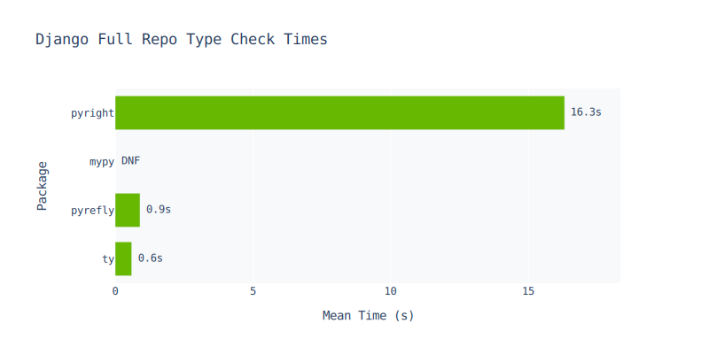

> Note: I like using em-dashes while writing! Don't worry, this is not written by AI. <sup>[(context)](https://medium.com/@brentcsutoras/the-em-dash-dilemma-how-a-punctuation-mark-became-ais-stubborn-signature-684fbcc9f559)</sup> 

Earlier this month, two new Rust-based Python type checkers hit the spotlight: [pyrefly](https://github.com/facebook/pyrefly) and [ty](https://github.com/astral-sh/ty). Although neither is *officially* released, they are a welcome change to the Python type checking world, historically dominated by [mypy](https://mypy-lang.org/) and [pyright](https://github.com/microsoft/pyright). 

While both are open-source and publicly downloadable for quite some time, there have not been any official announcements by Meta nor Astral on their brand new next-generation Python type checkers — **until last week**.

At [PyCon 2025](https://us.pycon.org/2025/), nestled away in a quiet Room 319 at the [Typing Summit](https://us.pycon.org/2025/events/typing-summit/), we had our first official sneak peek into both of these tools — the team behind them, their goals, visions, and ambitions — and their unique approaches to tackling Python's typing problems.

<figure>
  
  <figcaption>ty team presenting at the typing summit</figcaption>
</figure>

> This blog is a collection of rough notes scribbled during the event, personal conversations with the team, and not-too-thorough experiments that I've run myself. As such, some details might be a little blurry.

> **Also, both of these tools are still in early alpha!**
>
> Please do not use this as a definitive judgment as to which one is better and/or worse. This blog is just for fun to see what state the two tools are at now!

> The following tests and experiments were performed on the latest versions of pyrefly, ty, mypy, and pyright as of writing this blog:
> - `pyrefly 0.17.0`
> - `ty 0.0.1-alpha.7 (afb20f6fe 2025-05-26)`
> - `mypy 1.15.0 (compiled: yes)`
> - `pyright 1.1.401`

# Pyrefly

Pyrefly is Meta's new Rust-based Python type checker, replacing [Pyre](https://pyre-check.org/) — Meta's previous Python type checker written in OCaml. The hopes are that Pyrefly should be faster, more portable, and more capable compared to Pyre. 

One key thing the Pyrefly team made very clear this year is that they want to be ***truly open source***. Pyre was also *technically* open source, but it was more of a "we built this for our needs, but here's the source code if you want it". In contrast, one of the foundational goals of Pyrefly is to be more engaged with the needs of the open-source community. 

<figure>
  <iframe width="560" height="315" src="https://www.youtube-nocookie.com/embed/ZTSZ1OCUaeQ?si=Rc3-M7a7Yh7SSq-X&amp;start=1405" title="YouTube video player" frameborder="0" allow="accelerometer; autoplay; clipboard-write; encrypted-media; gyroscope; picture-in-picture; web-share" referrerpolicy="strict-origin-when-cross-origin" allowfullscreen></iframe>
  <figcaption>pyrefly introduction presentation</figcaption>
</figure>

# ty

ty is also a Rust-based Python type checker currently under development by [Astral](https://astral.sh/), the team behind [uv](https://docs.astral.sh/uv/) and [ruff](https://github.com/astral-sh/ruff). The project was formerly known as Red-Knot, but now has its official name: ty. Compared to Meta, Astral is a lot more quiet on its announcement: just a soft launch on GitHub, a quick 30-minute presentation, and a couple of blog articles as podcasts here and there.

<figure>
  <iframe width="560" height="315" src="https://www.youtube-nocookie.com/embed/7uixlNTOY4s?si=qMCrwoIekSkoH3xF&amp;start=3558" title="YouTube video player" frameborder="0" allow="accelerometer; autoplay; clipboard-write; encrypted-media; gyroscope; picture-in-picture; web-share" referrerpolicy="strict-origin-when-cross-origin" allowfullscreen></iframe>
  <figcaption>ty introduction presentation</figcaption>
</figure>

# Similarities

Both pyrefly and ty are written in Rust, both are incremental (albeit implemented slightly differently: see details below), and both are powered under the hood by [Ruff](https://github.com/astral-sh/ruff) for AST parsing. Also, both have first-class support for command-line type checking and LSP/IDE integration. 

However, other than the fact that they are both fast Python type checkers, that's where the similarities end. In my opinion, there are four categories in which these two tools differ: **in Speed, Goals, Incrementalization, and Capabilities.** That's what we'll explore today.

# Speed

Speed seemed like one of the main focuses of Pyrefly, being mentioned multiple times during the intro presentation. According to the team, it's 35x faster than Pyre and 14x faster than Mypy/Pyright, with support of up to 1.8 million lines of code per second. Fast enough to "type check on every keystroke".

In comparison, speed was also one of the main design goals for ty, but it felt like less of a focus during the introduction. The only claim was "1-2 orders of magnitude faster than current generation type checkers". Naturally, I wanted to test performance out for myself.

## Benchmarking - PyTorch

For the first test, I cloned and checked out the latest release of PyTorch (`v2.7.0`) and compared type check times between pyrefly, ty, mypy, and pyright on a MacBook M4. Two tests were run, one on the entire `pytorch` repository and another on just the `torch` subdirectory:

> PyTorch on the latest mypy is not supported. Using `mypy 1.14.0` instead.



- **pyrefly:** `hyperfine --warmup 3 --runs 5 --ignore-failure 'pyrefly check'`
- **ty:** `hyperfine --warmup 3 --runs 5 --ignore-failure 'ty check'`
- **mypy:** `hyperfine --warmup 3 --runs 5 --ignore-failure 'mypy --cache-dir=/dev/null .'`
- **pyright:** `hyperfine --warmup 3 --runs 5 --ignore-failure 'pyright'`



```
ty
  Time (mean ± σ):      4.039 s ±  0.234 s    [User: 19.135 s, System: 3.850 s]
  Range (min … max):    3.888 s …  4.455 s    5 runs

pyrefly
  Time (mean ± σ):     13.029 s ±  0.136 s    [User: 60.489 s, System: 6.297 s]
  Range (min … max):   12.916 s … 13.184 s    5 run

mypy
  dnf

pyright
  Time (mean ± σ):     262.742 s ±  4.948 s    [User: 472.717 s, System: 18.898 s]
  Range (min … max):   259.173 s … 270.617 s    5 runs
```




- **pyrefly:** `hyperfine --warmup 3 --runs 10 --ignore-failure 'pyrefly check torch'`
- **ty:** `hyperfine --warmup 3 --runs 10 --ignore-failure 'ty check torch'`
- **mypy:** `hyperfine --warmup 3 --runs 10 --ignore-failure 'mypy --cache-dir=/dev/null torch'`
- **pyright:** `hyperfine --warmup 3 --runs 10 --ignore-failure 'pyright torch'`



```
ty
  Time (mean ± σ):      1.123 s ±  0.022 s    [User: 6.460 s, System: 0.604 s]
  Range (min … max):    1.082 s …  1.167 s    10 runs

pyrefly
  Time (mean ± σ):      2.347 s ±  0.261 s    [User: 15.876 s, System: 0.919 s]
  Range (min … max):    2.089 s …  2.988 s    10 runs
  
mypy
  Time (mean ± σ):     24.731 s ±  0.238 s    [User: 24.144 s, System: 0.519 s]
  Range (min … max):   24.299 s … 25.016 s    10 runs
  
pyright
  Time (mean ± σ):     48.096 s ±  1.705 s    [User: 68.526 s, System: 4.072 s]
  Range (min … max):   46.037 s … 50.488 s    10 runs
```


Out of the gate, we see that for both `pytorch` and just `torch`, ty is about 2-3x faster compared to pyrefly, and both are over 10x-20x faster than mypy and pyright.

> One interesting note is that pyrefly detected more source files than ty: about 8600 for pyrefly and 6500 for ty on `pytorch` (I'm not sure where the discrepancy comes from).

> **It's also important to remember that both pyrefly and ty are still in early alpha, and are not feature complete. This may skew the results!**

## Benchmarking - Django

Next, I ran the same benchmark on Django version 5.2.1.

> Note: mypy errored out during this test.




- **pyrefly:** `hyperfine --warmup 3 --runs 10 --ignore-failure 'pyrefly check'`
- **ty:** `hyperfine --warmup 3 --runs 10 --ignore-failure 'ty check'`
- **mypy:** `hyperfine --warmup 3 --runs 10 --ignore-failure 'mypy --cache-dir=/dev/null .'`
- **pyright:** `hyperfine --warmup 3 --runs 10 --ignore-failure 'pyright'`



```
ty
  Time (mean ± σ):     578.2 ms ±  27.8 ms    [User: 2980.4 ms, System: 546.9 ms]
  Range (min … max):   557.1 ms … 634.0 ms    10 runs

pyrefly
  Time (mean ± σ):     910.7 ms ±  26.2 ms    [User: 3033.0 ms, System: 565.0 ms]
  Range (min … max):   879.6 ms … 963.1 ms    10 runs
  
mypy
  dnf
  
pyright
  Time (mean ± σ):     16.324 s ±  0.476 s    [User: 24.477 s, System: 1.682 s]
  Range (min … max):   15.845 s … 17.182 s    10 runs
```


We see the same results across the board with ty being the fastest (2,900 files at 0.6s), pyrefly as a close second (3,200 files at 0.9s), and pyright being the slowest (16s).

## Benchmarking - Mypy

Finally, I ran the benchmark on the `mypy` repo itself (more specifically the `mypyc` subdirectory). Similar results here.



- **pyrefly:** `hyperfine --warmup 3 --runs 20 --ignore-failure 'pyrefly check mypyc'`
- **ty:** `hyperfine --warmup 3 --runs 20 --ignore-failure 'ty check mypyc'`
- **mypy:** `hyperfine --warmup 3 --runs 20 --ignore-failure 'mypy --cache-dir=/dev/null mypyc'`
- **pyright:** `hyperfine --warmup 3 --runs 20 --ignore-failure 'pyright mypyc'`



```
ty
  Time (mean ± σ):      74.2 ms ±   1.5 ms    [User: 403.4 ms, System: 41.6 ms]
  Range (min … max):    71.9 ms …  78.1 ms    20 runs

pyrefly
  Time (mean ± σ):     136.0 ms ±   1.5 ms    [User: 728.3 ms, System: 54.5 ms]
  Range (min … max):   133.4 ms … 139.6 ms    20 runs
  
mypy
  Time (mean ± σ):      3.544 s ±  0.099 s    [User: 3.442 s, System: 0.093 s]
  Range (min … max):    3.420 s …  3.774 s    20 runs
  
pyright
  Time (mean ± σ):      2.852 s ±  0.103 s    [User: 4.315 s, System: 0.227 s]
  Range (min … max):    2.704 s …  3.105 s    20 runs
```


# Goals

The primary goals between pyrefly and ty are where I feel the main difference lies. Pyrefly tries to be as aggressive as possible when typing — inferring as much as possible so that even code with absolutely no explicit types can have some amount of typing guarantees.

ty, on the other hand, follows a different mantra: **the gradual guarantee**. The principal idea is that in a well-typed program, removing a type annotation should not cause a type error. In other words: you shouldn't need to add new types to working code to resolve type errors.

<figure>
  
  <figcaption>the gradual guarantee slide from ty presentation</figcaption>
</figure>

This is shown in this example here:

```python
class MyClass:
    attr = None

foo = MyClass()

# ➖ pyrefly | revealed type: None
# ✅ ty.     | Revealed type: `Unknown | None`
# ➖ mypy.   | Revealed type is "None"
# ➖ pyright | Type of "foo.attr" is "None"
reveal_type(foo.attr)

# ➖ pyrefly | ERROR: Literal[1] is not assignable to attribute attr with type None
# ✅ ty.     | < No Error >
# ➖ mypy.   | ERROR: Incompatible types in assignment (expression has type "int", variable has type "None")
# ➖ pyright | ERROR: Cannot assign to attribute "attr" for class "MyClass"
foo.attr = 1
```

In this example, pyrefly, mypy, and pyright eagerly type `foo.attr` as `None` and throw an exception when assigned as `1` — whereas ty understands that `foo.attr = 1` should not actually cause a syntax error, and instead types `foo.attr` as `Unknown | None` to allow the assignment. (`Unknown` is a new type added by ty to denote between an *explicit* `Any` versus an *"unknown"* `Any`.)

As a consequence, this also means that pyrefly can catch some errors that other type checkers cannot. Take this example here:

```python
my_list = [1, "b", None]
val = my_list.pop(1)

# ✅ pyrefly | revealed type: int | str | None
# ➖ ty.     | Revealed type: `Unknown`
# ➖ mypy.   | Revealed type is "builtins.object"
# ➖ pyright | Type of "val" is "Unknown"
reveal_type(val)

# ✅ pyrefly | ERROR: `*` is not supported between `None` and `Literal[2]`
# ➖ ty.     | < No Error >
# ➖ mypy.   | ERROR: Unsupported operand types for * ("object" and "int")
# ➖ pyright | < No Error >
new_val = val * 2
```

> mypy *technically* did throw an error, but for the wrong reasons. For example, setting `my_list = [1, "b"]` would fix the program, but mypy still reports a mismatch between `object` and `int`.

Pyrefly implicitly types `val` as `int | str | None`, even though neither `val` nor `my_list` was explicitly typed. This correctly catches the `val * 2` error below.

This is just one of many examples, as more will be shown later in the **Capabilities** section.

# Incrementalism

Both pyrefly and ty claim to be incremental — meaning that changing one file would only cause a re-parse on the affected area, and not the entire program. Pyrefly uses a custom incremental engine behind the scenes for its type checker. In constrast, ty uses [Salsa](https://github.com/salsa-rs/salsa), the same incremental framework that powers [Rust Analyzer](https://rust-analyzer.github.io/).

Interestingly, what that means is that ty has fine-grained incrementalization: changing a single function would only cause a re-parse on that function itself (and nothing else), and its dependent functions, and so on. Pyrefly, on the other hand, uses module-level incrementation: changing a single function would cause a re-parse on the entire file/module, and its dependent files/modules, etc.

The reason why pyrefly chose module-level over fine-grained (at least from what I've gathered) is that module-level incrementalization is already fast enough in Rust, and fine-grained incrementalization results in a much more complex and harder to maintain codebase with minimal performance improvements.

# Capabilities

Both the pyrefly and ty teams make it VERY CLEAR that they are still unfinished and in early alpha, with known issues, bugs, and incomplete features. Despite that, I think it's cool to go over what each supports *as of now* as it showcases what each team has focused on and determined to be important so far for their next-generation Python type checkers.

## Implicit Type Inference

Implicit type inference is one of the showcase features of pyrefly. For example, here is a simple case of inferring return types:

```python
def foo(imp: Any):
    return str(imp)

a = foo(123)

# ✅ pyrefly | revealed type: str
# ➖ ty.     | Revealed type: `Unknown`
# ➖ mypy.   | Revealed type is "Any"
# ✅ pyright | Type of "a" is "str"
reveal_type(a)

# ✅ pyrefly | ERROR: `+` is not supported between `str` and `Literal[1]`
# ➖ ty.     | < No Error >
# ➖ mypy.   | < No Error >
# ✅ pyright | ERROR: Operator "+" not supported for types "str" and "Literal[1]"
a + 1
```

Here's another example with inferring types of more complex collection objects (in this case, a `dict`):

```python
from typing import reveal_type

my_dict = {
    key: value * 2
    for key, value in {"apple": 2, "banana": 3, "cherry": 1}.items()
    if value > 1
}

# ✅ pyrefly | revealed type: dict[str, int]
# ➖ ty.     | Revealed type: `@Todo`
# ✅ mypy.   | Revealed type is "builtins.dict[builtins.str, builtins.int]"
# ✅ pyright | Type of "my_dict" is "dict[str, int]"
reveal_type(my_dict)
```

**But,** here is where the "gradual guarantee" of ty comes in. Take this example here:

```python
my_list = [1, 2, 3]

# ✅ pyrefly | revealed type: list[int]
# ➖ ty.     | Revealed type: `list[Unknown]`
# ✅ mypy.   | Revealed type is "builtins.list[builtins.int]"
# ✅ pyright | Type of "my_list" is "list[int]"
reveal_type(my_list)

# ➖ pyrefly | ERROR: Argument `Literal['foo']` is not assignable to parameter with type `int` in function `list.append`
# ✅ ty.     | < No Error >
# ➖ mypy.   | ERROR: Argument 1 to "append" of "list" has incompatible type "str"; expected "int" 
# ➖ pyright | ERROR: Argument of type "Literal['foo']" cannot be assigned to parameter "object" of type "int" in function "append"
my_list.append("foo")
```

pyrefly, mypy, and pyright all assume that `my_list.append("foo")` is a typing error, even though it is *technically* allowed (Python collections can have multiple types of objects!) If this is the intended behavior, ty is the only checker that implicitly allows this without requiring additional explicit typing on `my_list`.

> **Quick Correction:** The ty team has mentioned that this is *not* an intended feature, and instead caused by incomplete inference of generic container literals. You can read more about it in this [HN thread](https://news.ycombinator.com/item?id=44108931).

## Generics

Another thing the pyrefly team mentioned during their talk was that while redesigning pyrefly from the ground up, they focused on the "hard problems first". This means that a lot of the architecture around pyrefly was built around things like generics, overloads, and wildcard imports.

For example, here are some examples where pyrefly and ty both have correct generic resolution:

```python
# === Simple Case ===
class Box[T]:
    def __init__(self, val: T) -> None:
        self.val = val

b: Box[int] = Box(42)

# ✅ pyrefly | revealed type: int
# ✅ ty.     | Revealed type: `Unknown | int`
# ✅ mypy.   | Revealed type is "builtins.int"
# ✅ pyright | Type of "b.val" is "int"
reveal_type(b.val)

# ✅ pyrefly | ERROR: Argument `Literal[100]` is not assignable to parameter `val` with type `str` in function `Box.__init__`
# ✅ ty.     | ERROR: Object of type `Box[int]` is not assignable to `Box[str]`
# ✅ mypy.   | ERROR: Argument 1 to "Box" has incompatible type "int"; expected "str"
# ✅ pyright | ERROR: Type "Box[int]" is not assignable to declared type "Box[str]"
b2: Box[str] = Box(100)

# === Bounded Types with Attribute ===
class A:
    x: int | str

def f[T: A](x: T) -> T:
    # ✅ pyrefly | revealed type: int | str
    # ✅ ty.     | Revealed type: `int | str`
    # ✅ mypy.   | Revealed type is "Union[builtins.int, builtins.str]"
    # ✅ pyright | Type of "x.x" is "int | str"
    reveal_type(x.x)
    return x
```

Whereas here are some examples where pyrefly has better generic resolution compared to ty:

```python
from typing import Callable, TypeVar, assert_type, reveal_type
    
# === Generic Class Without Explicit Type Param ===

class C[T]:
    x: T

c: C[int] = C()

# ✅ pyrefly | revealed type: C[int]
# ➖ ty.     | `C[Unknown]`
# ✅ pypy.   | Revealed type is "__main__.C[builtins.int]"
# ✅ pyright | Type of "c" is "C[int]"
reveal_type(c)

# ✅ pyrefly | revealed type: int
# ➖ ty.     | Revealed type: `Unknown`
# ✅ pypy.   | Revealed type is "builtins.int"
# ✅ pyright | Type of "c.x" is "int"
reveal_type(c.x)

# === Bounded Types with Callable Attribute ===

def func[T: Callable[[int], int]](a: T, b: int) -> T:
    # ✅ pyrefly | revealed type: int
    # ➖ ty.     | ERROR: <Error: Object of type `T` is not callable>
    # ✅ pypy.   | Revealed type is "builtins.int"
    # ✅ pyright | Type of "a(b)" is "int"
    reveal_type(a(b))
    return a
```

Interestingly enough, both pyrefly and ty seem to struggle with resolving covariance and contravariance relationships. Example here:

```python
from __future__ import annotations

class A[X]:
    def f(self) -> B[X]:
        ...

class B[Y]:
    def h(self) -> B[Y]:
        ...

def cast_a(a: A[bool]) -> A[int]:
    # ➖ pyrefly | ERROR: Return type does not match returned value: expected `A[int]`, found `A[bool]`
    # ➖ ty.     | ERROR: Returned type `A[bool]` is not assignable to declared return type `A[int]`
    # ✅ mypy.   | < No Error >
    # ✅ pyright | < No Error >
    return a  # Allowed
```

## Informative Error Messages

One explicit feature of ty is to have clear and concise error messages. 

For example, here is a simple example of a function call with mismatched types:


Compared to pyrefly, mypy, and pyright:


Here is another example with mismatched return types:


In my opinion, much cleaner! It's exciting to see new and improved error messages coming to Python.

## Intersection and Negation Types

Finally, one really cool feature the Astral team showed off was support for intersection and negation types — which they claim is the only Python type checker to implement. To illustrate this, take a look at this example:

```python
class WithX:
  x: int

@final
class Other:
  pass

def foo(obj: WithX | Other):
  if hasattr(obj, "x"):
    # ➖ pyrefly | revealed type: Other | WithX
    # ✅ ty.     | Revealed type: `WithX`
    # ➖ mypy.   | Revealed type is "Union[__main__.WithX, __main__.Other]"
    # ➖ pyright | Type of "obj" is "WithX | Other"
    reveal_type(obj)
```

> `@final` is a new feature in Python 3.12 that prevents a class from being subclassed. This is important for the type checker to know that `Other` cannot be subclassed with `x` in the future.

Given the constraints that `obj` is either `WithX` or final type `Other`, and `obj` *has* to have attribute `x`, the only resolvable type for `obj` at `reveal_type(obj)` is `WithX`. Breaking down what happens behind the scenes:

```
(WithX | Other) & <Protocol with members 'x'>
=> (WithX & <Protocol with members 'x'> | (Other & <Protocol with members 'x'>)
=> WithX | Never
=> WithX
```

Take a look at another example here:

```python
class MyClass:
    ...

class MySubclass(MyClass):
    ...

def bar(obj: MyClass):
    if not isinstance(obj, MySubclass):
        # ➖ pyrefly | revealed type: MyClass
        # ✅ ty.     | Revealed type: `MyClass & ~MySubclass`
        # ➖ mypy.   | Revealed type is "__main__.MyClass"
        # ➖ pyright | Type of "obj" is "MyClass"
        reveal_type(obj)
```

ty is the only type checker to resolve `obj` at `reveal_type(obj)` to `MyClass & ~MySubclass`. This means that ty introduces new paradigms to Python types:

**intersections and negations!** Neat!

However, this is still in early alpha! For example, this case here:

```python
def bar(obj: HasFoo):
    if not hasattr(obj, "bar"):
        reveal_type(obj)
        reveal_type(obj.foo)
```

`reveal_type(obj)` has the correct type of `HasFoo & ~<Protocol with members 'bar'>`, but `reveal_type(obj.foo)` resolves to `@Todo` even though `obj.foo` should be resolvable to the function `foo` given the constraints.

As one final fun party trick, here is ty using intersection and negation types to "solve" [diophantine equations](https://en.wikipedia.org/wiki/Diophantine_equation):

```python
# Simply provide a list of all natural numbers here ...
type Nat = Literal[1, 2, 3, 4, 5, 6, 7, 8, 9, 10, 11, 12, 13]

def pythagorean_triples(a: Nat, b: Nat, c: Nat):
    reveal_type(a**2 + b**2 == c**2)
    # reveals 'bool': solutions exist (3² + 4² == 5²)

def fermats_last_theorem(a: Nat, b: Nat, c: Nat):
    reveal_type(a**3 + b**3 == c**3)
    # reveals 'Literal[False]': no solutions!

def catalan_conjecture(a: Nat, b: Nat):
    reveal_type(a**2 - b**3 == 1)
    # reveals 'bool': solutions exist (3² - 2³ == 1)
```

# Final Thoughts

Overall, it's exciting to have two new faster type checkers in the Python ecosystem! As of right now, pyrefly and ty seem to follow two different systematic goals. Ty takes a gradual approach to typing - given a program that (theoretically) runs flawlessly, running a type checker should not raise any new typing errors - and if it does, it probably indicates an actual flaw somewhere in the code. Pyrefly takes a different approach, one that is similar to many state-of-the-art Python type checkers today - infer as many types as possible, at the cost of possibly introducing typing errors where it shouldn't.

As mentioned multiple times, both pyrefly and ty are in early alpha. I strongly suspect the features and capabilities of both tools will converge as time goes on, but nevertheless, it is still cool to see where the two type checkers are at now and how they might come into play in different scenarios sometime in the future.

**Go try these out for yourself now!**

You can try out pyrefly over at **[pyrefly.org/sandbox](https://pyrefly.org/sandbox)**, and ty over at **[play.ty.dev](https://play.ty.dev)**. Both also have their respective `pip install`/`uv add`/`poetry add`/`uvx` commands and plugins for your editor (VSCode, Cursor, etc).

In the meantime, I heard rumors that Google is planning on open-sourcing their own Go-based Python type checker, so it'll be very cool to check that out once it comes out 👀 ...

## Appendix

I just wanted to call out that ty's tests are written in... **MARKDOWN**! How cool is that?

> **[https://github.com/astral-sh/ruff/tree/main/crates/ty_python_semantic/resources/mdtest](https://github.com/astral-sh/ruff/tree/main/crates/ty_python_semantic/resources/mdtest)**

<hr/>

*Thanks for reading!*

*If you notice any mistakes, comments, or feedback, please let me know!*

*Contact: [blog@edward-li.com](mailto:blog@edward-li.com)*
